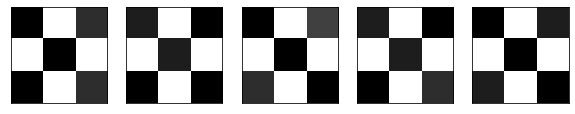
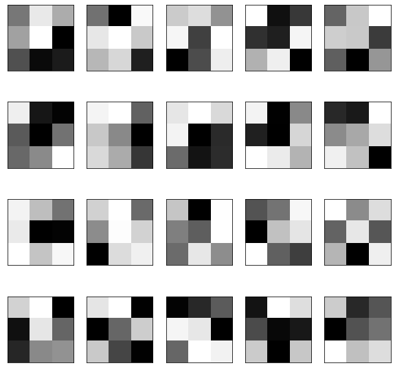
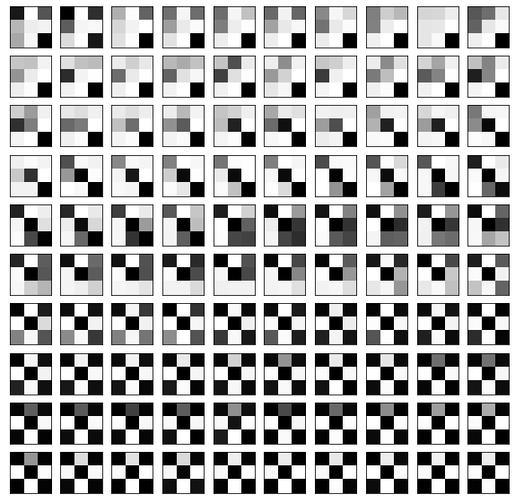
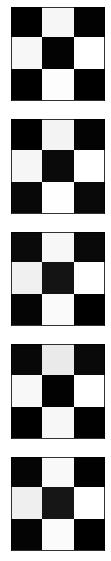
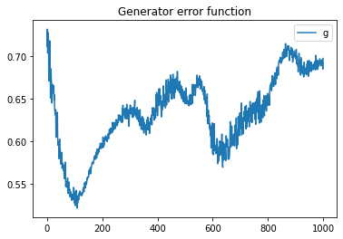
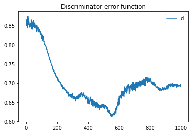

### Importe


```python
# IMPORTS

# ...
import torch
import torch.nn as nn
import torch.optim as optim

import numpy as np
from numpy import random
from matplotlib import pyplot as plt
%matplotlib inline
```

### Hilfsfunktion: Bilder darstellen


```python
def view_samples(samples, m, n):
    fig, axes = plt.subplots(figsize=(10,10), nrows=m, ncols=n, sharey=True, sharex=True)
    for ax, img in zip(axes.flatten(), samples):
        ax.xaxis.set_visible(False)
        ax.yaxis.set_visible(False)
        im = ax.imshow(1-img.reshape((3,3)), cmap='Greys_r')
    return fig, axes
```

### Beispiel Symbole: Trainings Daten


```python
symbols = np.array(
    [[1.0, 0.0, 0.85, 0.0, 1.0, 0.0, 1.0, 0.0, 0.85],
    [0.9, 0.0, 1.0, 0.0, 0.9, 0.0, 1.0, 0.0, 1.0],
    [1.0, 0.0, 0.8, 0.0, 1.0, 0.0, 0.85, 0.0, 1.0],
    [0.9, 0.0, 1.0, 0.0, 0.9, 0.0, 1.0, 0.0, 0.85],
    [1.0, 0.0, 0.9, 0.0, 1.0, 0.0, 0.9, 0.0, 1.0]
    ])

_ = view_samples(symbols, 1, 5)
```


    

    


### Beispiel Symbole: Zufalls Daten


```python
noise = np.random.uniform(0, 1, size=(20,9))

_ = view_samples(noise, 4, 5)
```


    

    


### Generator


```python
class Generator(nn.Module):
    def __init__(self, size):
        super().__init__()
        self.model = nn.Sequential(
            nn.Linear(size, size),
            nn.LeakyReLU(0.2),
            nn.Tanh()
        )
    
    def forward(self, x):
        return self.model(x)
```

### Discriminator


```python
class Discriminator(nn.Module):
    def __init__(self, size):
        super().__init__()
        self.model = nn.Sequential(
            nn.Linear(size, 1),
            nn.Sigmoid()
        )
        
    def forward(self, x):
        return self.model(x)
```

### Variablen definieren


```python
TRAINING_STEPS = 1000

LEARNING_RATE = 0.001

BATCH_SIZE = 5

SYMBOL_SIZE = 9

#...
```


```python
# For the error plot
errors_discriminator = []
errors_generator = []
```

### Definition: Trainingsprozess


```python
def train(training_steps, learning_rate, batch_size, symbol_size):
    
    # Set random seed
    np.random.seed(42)

    generated_process = []
    
    generator = Generator(symbol_size)
    discriminator = Discriminator(symbol_size)
    
    discriminator_optimizer = torch.optim.Adam(discriminator.parameters(), lr = learning_rate)
    generator_optimizer = torch.optim.Adam(generator.parameters(), lr = learning_rate)
    
    
    loss = nn.BCELoss()
    
    for i in range(training_steps):
        generator_optimizer.zero_grad()
        
        noise = np.random.uniform(0, 1, size=(batch_size, symbol_size))
        noise = torch.tensor(noise).float()
        
        generated_data = generator(noise)
        
        generated_process.append(generated_data[0].detach().numpy())
        
        true_labels = np.ones((batch_size, 1))
        true_labels = torch.tensor(true_labels).float()
        
        true_data = torch.tensor(symbols).float()
        
        # Training des Discriminators mit true Labels
        discriminator_optimizer.zero_grad()
        true_discriminator_out = discriminator(true_data)
        true_discriminator_loss = loss(true_discriminator_out, true_labels)

        # Training des Discriminators mit fakes
        generator_discriminator_out = discriminator(generated_data.detach())
        generator_discriminator_loss = loss(generator_discriminator_out, torch.zeros(batch_size, 1))
        discriminator_loss = ((
            true_discriminator_loss +
            generator_discriminator_loss) / 2
        )
        errors_discriminator.append(discriminator_loss)
        discriminator_loss.backward()
        discriminator_optimizer.step()
        
        # Training des Generators
        generator_discriminator_out = discriminator(generated_data)
        generator_loss = loss(generator_discriminator_out, true_labels)
        errors_generator.append(generator_loss)
        generator_loss.backward()
        generator_optimizer.step()
        
    return generator, generated_process
```

### Ausführen: Training


```python
##########
generator, generated = train(TRAINING_STEPS, LEARNING_RATE, BATCH_SIZE, SYMBOL_SIZE)
##########
```


```python
generated = np.array(generated)
generated.shape
```


    (1000, 9)


```python
generated = generated[0::10]
generated.shape
```


    (100, 9)


```python
_ = view_samples(generated, 10, 10)
```


    

    


```python
# Set random seed
np.random.seed(42)

noise = np.random.uniform(0, 1, size=(5, 9))
noise = torch.tensor(noise).float()

gen = generator(noise)

gen = gen.detach().numpy()

_ = view_samples(gen, 5, 1)
```


    

    


```python
plt.plot(errors_generator)
plt.title("Generator error function")
plt.legend("gen")
plt.show()
plt.plot(errors_discriminator)
plt.legend('disc')
plt.title("Discriminator error function")
```


    

    


    Text(0.5, 1.0, 'Discriminator error function')


    

    

